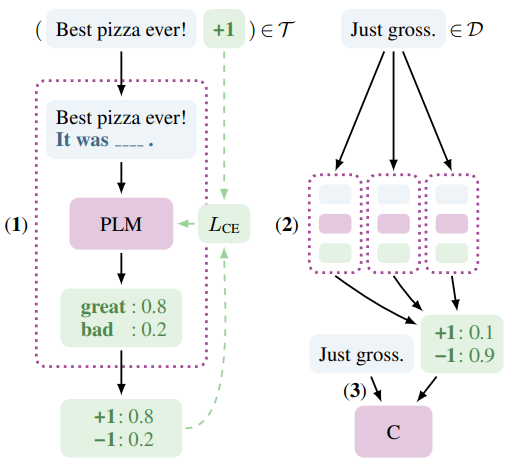
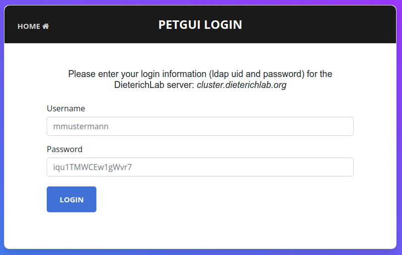
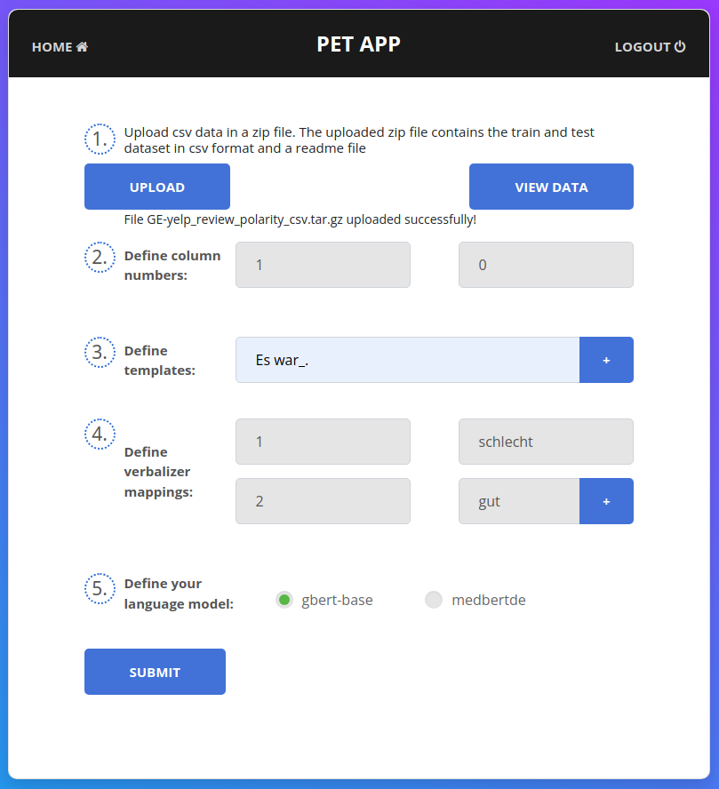
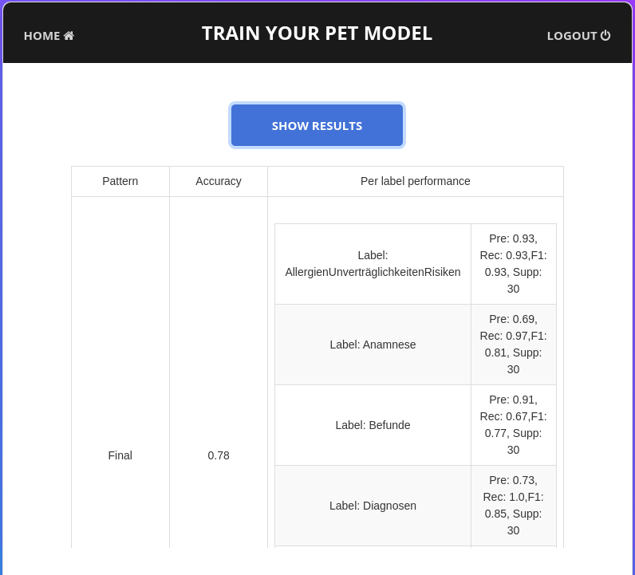
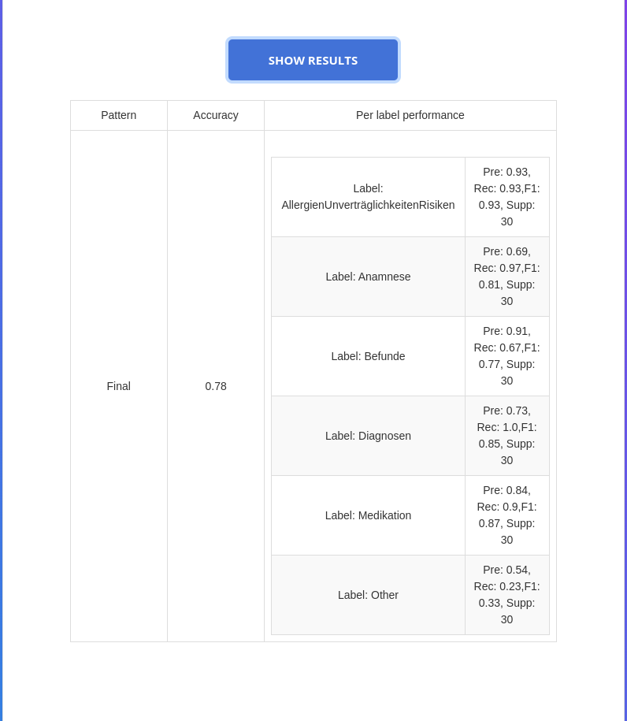
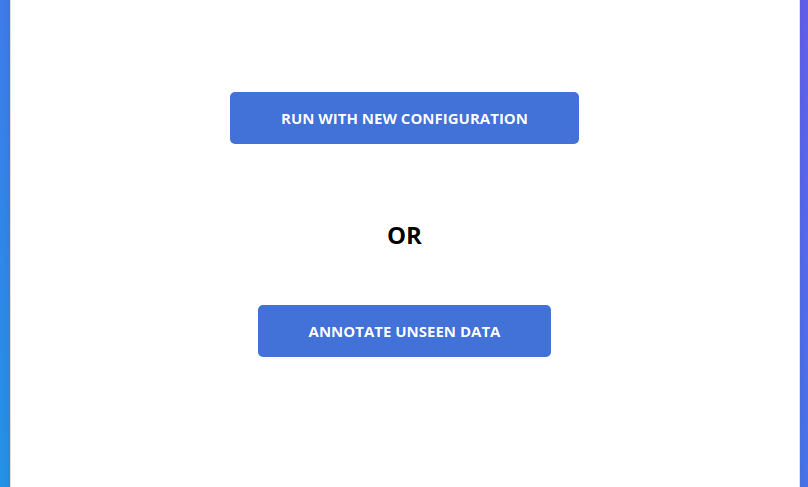
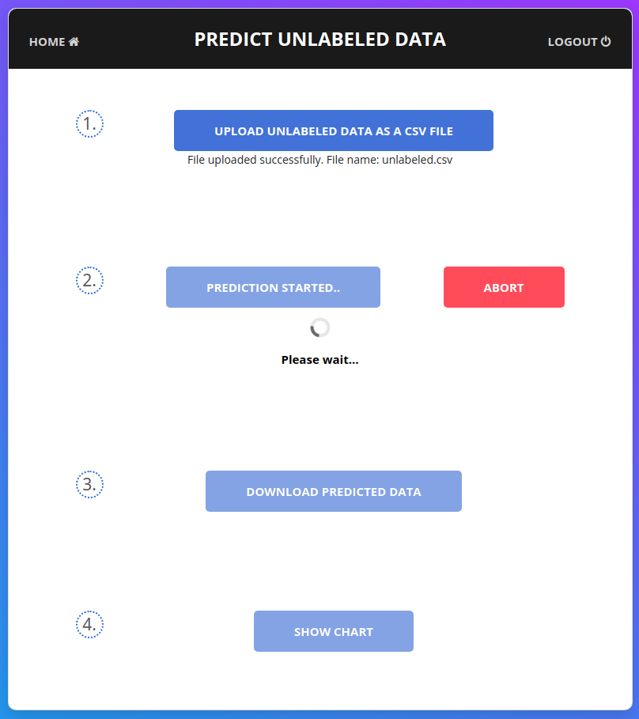

# PETGUI

We present PETGUI (Pattern-Exploiting Training GUI), a user-friendly graphical user interface for training,
testing and labeling with pre-trained masked language models using Pattern-Exploiting Training, a state-of-the-art machine learning framework for text classification tasks using few-shot learning and prompting. Concretely, PETGUI facilitates
a multistep pipeline of training and testing on labeled data, followed by annotating
on unlabeled data in a comprehensible and intuitive way. PETGUI also provides
valuable insights into various aspects of the training, with statistics for label distribution and model performance. We envision our app as a pivotal use-case of a
simple machine learning application, that is accessible and manageable by users
without domain specific knowledge, in our case by physicians from clinical routine.


## 🔎 Contents
- [*Pattern Exploiting Training*](#pet)
- [🧰 PETGUI Requirements](#requirements)
- [⚙️ PETGUI Setup](#setup)
- [🛫 Start PETGUI](#start)
- [👟 Run PETGUI](#run)
- [➕ Features](#features)
- [➖ Limitations](#limitations)
- [🗃️ References](#references)

<a id="pet"></a>
### *Pattern Exploiting Training*
<p style="font-size: 15px;">PET (Pattern-Exploiting Training) is a semi-supervised training strategy for language models.
                        By reformulating input examples as cloze-style phrases, it has been shown to significantly outperform standard supervised training<a href="#pet"> (Schick et al., 2021)</a>, especially valuable for low-resource settings, such as the German clinical domain <a href="#mie"> (Richter-Pechanski et al., 2023)</a>.


<figure>
  
    <figcaption style="font-size: 12px">Fig.1 - Illustration of the PET workflow, see <a href="#pet">Schick et al., 2021</a></figcaption>
</figure>

In this illustration, the pattern <span style="font-style: italic">"It was ___ ."</span> is a cloze-style phrase, textually explaining to the model what the task is about,
in this case: <span style="font-style: italic;"> sentiment classification</span>. <br> For this, PET works in the following way: A pretrained language model is first trained on each of such patterns <strong>(1)</strong>. <br>
Secondly, an ensemble of these models annotates unlabeled training data <strong>(2)</strong>. <br> Finally, a classifier is trained on the resulting soft-labeled dataset <strong>(3)</strong>.</p>


<a id="requirements"></a>
### 🧰 PETGUI Requirements
* A Linux host system
* A connection to a remote Slurm cluster with GPUs, accessible via LDAP
* Docker=1.5-2
* Python=3.11
* Torch=2.1.1 (on the remote Slurm cluster)

To run **PETGUI** on your machine, you need:
1. A **working connection** to a remote Slurm cluster.
2. **Ldap credentials** for accessing the remote Slurm cluster.
3. The **ca-certificate file** for the remote Slurm cluster.

<a id="setup"></a>
### Installation

1. In a terminal, `git clone` the repo and change directory to it.
2. Adapt the Slurm configuration SBATCH lines of [train.sh](/conf/train.sh) and [predict.sh](/conf/predict.sh) for your remote Slurm cluster:
```
#SBATCH --partition=gpu
#SBATCH --gres=gpu:pascal:1
#SBATCH -n 1
#SBATCH -N 1
#SBATCH -c 2
#SBATCH --mem=16G
#SBATCH --job-name=petgui
```
2. Adapt [conf.yaml](/conf/conf.yaml) to the LDAP server specifications for your remote Slurm cluster:
```
"CLUSTER_NAME" : "cluster.ORGANISATION-NAME.org"

"LDAP_SERVER" : 'ldap://ldap2.ORGANISATION-NAME.org'
"CA_FILE" : 'ORGANISATION-NAME_CA.pem'
"USER_BASE" : 'dc=ORGANISATION-NAME,dc=org'
"LDAP_SEARCH_FILTER" : '({name_attribute}={name})'

```
3. Move your certificate file of the server to `/conf` directory ([example reference file](/conf/example/ORGANISATION-NAME_CA.pem)).  
4. Build docker image: `docker build . -t petgui`.  

<a id="start"></a>
### 🛫 Start PETGUI
1. Change directory to repository: `cd /PETGUI`
1. Run the docker container: `docker run --name petgui -p 89:89 --mount type=bind,source=./conf,target=/home/appuser/conf petgui` 
>INFO:     Started server process [1]  
>INFO:     Waiting for application startup.  
>INFO:     Application startup complete.  
>INFO:     Uvicorn running on http://0.0.0.0:89 (Press CTRL+C to quit)  

3. Open localhost `http://localhost:89` in a browser.

<a id="run"></a>
### 👟️ Run PETGUI

You successfully started **PETGUI**! To run PETGUI, please see the below steps.    

| Steps                                                                                                                                                                                                                                                                                                                                                                                                                                                                                    | What you will see             |
|------------------------------------------------------------------------------------------------------------------------------------------------------------------------------------------------------------------------------------------------------------------------------------------------------------------------------------------------------------------------------------------------------------------------------------------------------------------------------------------|-------------------------------|
| **1.** Login with ldap credentials for your remote Slurm cluster:                                                                                                                                                                                                                                                                                                                                                                                                                        |  |
| **2.** Input training parameters, for the German few-shot sample [data](/data/GE-yelp_review_polarity_csv.tar.gz): <br/> SAMPLE: **1**, LABEL: **0**<br/> TEMPLATE: **Es war _ .** (include underscore character: "_" as a separator in the template, </br>click "+" to add more)<br/> VERBALIZER: 1 **schlecht**, 2 **gut**<br/> Chose one of pre-defined language model: `gbert-base` or `medbert`.</br> Click `View Data` to get statistics on your data as label distribution plots. |  |                               |
| **3.** Click `Submit` to proceed. `Start Training` to start the model training. You may `Abort` the process, which will terminate training</br> and navigate you to step **2.**                                                                                                                                                                                                                                                                                                          |  |
| **4.** `Show Results` to view model results, displaying accuracy per pattern, as well as precision, recall, f1-measure, and support per label.                                                                                                                                                                                                                                                                                                                                           |  |
| **5.** Choose to either re-train with new parameters (`Run with new configuration`) or continue wit trained model for labeling unseen data (`Annotate unseen data`).                                                                                                                                                                                                                                                                                                                     |  |
| **6.** Test the model on evaluation data (sample [data](/data/predict.txt)): `Upload unlabeled data as a csv file` and make sure, that the first column in your dataset contains nothing throughout your data lines. `Predict Labels Using PET Model` starts prediction process. When complete, `Download Predicted Data`.                                                                                                                                                               |  |


### Stop PETGUI
In the terminal: `Ctrl + C` to stop the running "uvicorn" process:
>^CINFO:     Shutting down  
>INFO:     Waiting for application shutdown.  
>INFO:     Application shutdown complete.  
>INFO:     Finished server process [1]
* To restart PETGUI:  
In the terminal:
1. `docker stop petgui`
2. `docker rm petgui`
3. `docker run...` from [2.](#start)


<a id="features"></a>
### ➕ Features
PETGUI provides an intuitive GUI for the PET workflow. Concretely, with PETGUI you can:

* Display statistics on <b>label distribution</b> of the training data
* <strong>Train</strong> either <span style="font-style: italic">bert-base-cased</span> or <span style="font-style: italic">medbert-512</span> on a labeled dataset
* Display statistics on the <b>model performance</b>
* <strong>Test</strong> the trained model to generate predictions on unseen data 
* Download the <b>labeled file</b>


<a id="limitations"></a>
### ➖ Limitations
In its current form, PETGUI is bound by the following requirements, which we may further simplify in future work:
* **Connection to remote Slurm cluster:** You must have a working connection to a remote Slurm cluster.
* **File format and naming convention:** The provided training data must be a <span style="font-style: italic">tar.gz</span> file
                                containing _train.csv_, _test.csv_ and _unlabeled.csv_, like our [sample training data](data/train.tar.gz).
                                The evaluation data must be a comma separated <span style="font-style: italic">.txt</span> file with the first column empty throughout, like our [sample test data](data/predict.txt).
* **Verbalizer mapping:** The tokenizer splits words into sub-words, e.g.: "Langeswort" becomes "Langes" and "#wort".
The provided verbalizer has to map to a single input-id, hence the user must provide a sub-word from the model vocabulary. </br> We plan on adding user feedback to ensure correct input.

<a id="references"></a>  ​                     
### 🗃️ References
<ol style="margin-left: 17px; font-size: 15px;">
    <li id="pet">Timo Schick and Hinrich Schütze. (2021). Exploiting Cloze Questions for Few-Shot Text Classification and Natural Language Inference. arXiv preprint arXiv:2001.07676.</a></li>
    <li id="schick">Timo Schick. (2023). Pattern-Exploiting Training (PET) <a href="https://github.com/timoschick/pet/">GitHub repository</a></li>
    <li id="mie">Richter-Pechanski P, Wiesenbach P, Schwab DM, Kiriakou C, He M, Geis NA, Frank A, Dieterich C. Few-Shot and Prompt Training for Text Classification in German Doctor's Letters. Stud Health Technol Inform. 2023 May 18;302:819-820. doi: 10.3233/SHTI230275. PMID: 37203504.
</ol>
